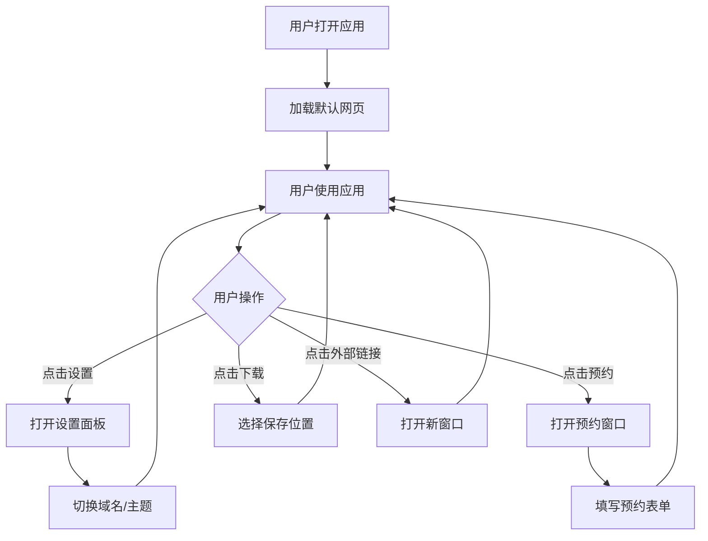

# TRAE SOLO 桌面包装器 - 产品需求文档

## 1. Product Overview
TRAE SOLO 桌面包装器是一个跨平台应用程序，旨在将 TRAE SOLO 的网页版本包装为原生桌面应用。
- 主要目的是为用户提供更流畅、更接近原生应用的使用体验，解决网页版在浏览器中打开的局限性。
- 目标用户是需要频繁使用 TRAE SOLO 服务的个人用户，特别是对界面美观度和操作便捷性有要求的用户。

## 2. Core Features

### 2.1 User Roles
| 角色 | 注册方式 | 核心权限 |
|------|---------------------|------------------|
| 普通用户 | 无需注册 | 使用所有应用功能 |

### 2.2 Feature Module
1. **主窗口**：无边框设计，自定义标题栏，内嵌网页内容
2. **设置面板**：切换域名（国际版/国内版），切换深色模式
3. **预约功能**：弹出窗口显示预约表单
4. **下载处理**：直接选择下载位置
5. **外部链接处理**：美化的新窗口显示

### 2.3 Page Details
| 页面名称 | 模块名称 | 功能描述 |
|-----------|-------------|---------------------|
| 主窗口 | 标题栏 | 包含关闭、最大化、最小化按钮，设置按钮和预约按钮 |
| 主窗口 | 内容区域 | 内嵌显示 TRAE SOLO 网页内容 |
| 设置面板 | 域名设置 | 切换使用国际版 (solo.trae.ai) 或国内版 (solo.trae.cn) |
| 设置面板 | 主题设置 | 切换浅色/深色模式 |
| 预约窗口 | 表单区域 | 显示并使用官方预约表单，功能完整可用 |
| 外部链接窗口 | 内容区域 | 显示非同一域名的链接内容，保持美观的窗口样式 |

## 3. Core Process
用户打开应用程序 → 应用加载默认域名的网页 → 用户可以通过设置按钮切换域名和主题 → 用户可以点击预约按钮打开预约窗口 → 用户在应用内浏览内容，点击下载链接时直接选择保存位置 → 点击外部链接时在新窗口中打开

## 4. User Interface Design
### 4.1 Design Style
- 主色调：#1a1a1a（深色）、#ffffff（浅色）
- 辅助色：#0070f3（蓝色）
- 按钮风格：圆角设计，有悬停效果
- 字体：系统默认字体，清晰易读
- 布局风格：简洁现代，无边框设计
- 图标风格：简洁线条图标

### 4.2 Page Design Overview
| 页面名称 | 模块名称 | UI 元素 |
|-----------|-------------|-------------|
| 主窗口 | 标题栏 | 高度 60px，背景色与主题一致，按钮采用简洁图标设计，悬停时有颜色变化 |
| 主窗口 | 内容区域 | 占据整个窗口空间，内嵌网页内容，加载时有过渡效果 |
| 设置面板 | 整体布局 | 弹出式面板，宽度 300px，背景色与主题一致，选项清晰易选 |
| 预约窗口 | 整体布局 | 居中弹出窗口，宽度 500px，高度 400px，包含官方预约表单元素 |
| 外部链接窗口 | 整体布局 | 与主窗口风格一致，无边框设计，包含标题栏和内容区域 |

### 4.3 Responsiveness
- 桌面优先设计，支持不同屏幕分辨率
- 窗口大小可调整，内容区域自适应

### 4.4 3D Scene Guidance
- 不适用

## 5. Technical Requirements
- 技术栈：Electron.js
- 跨平台支持：Windows 10+ 和 Linux
- 打包方式：使用 electron-builder
- 依赖管理：npm 或 yarn

## 6. Acceptance Criteria
1. 应用能够在 Windows 和 Linux 平台正常运行
2. 无边框窗口设计，自定义标题栏美观
3. 设置功能能够切换域名和深色模式
4. 预约按钮能够弹出包含官方表单的窗口，功能完整可用
5. 下载文件时能够直接选择保存位置，不打开浏览器
6. 外部链接在新窗口中打开，保持美观的窗口样式
7. 整体用户体验流畅，界面美观